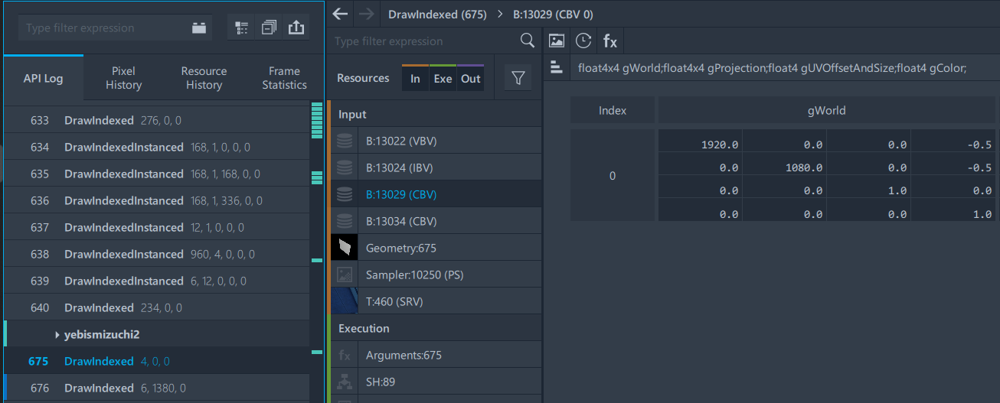

B8G8R8A8_UNORM 3440x1440 buffer that has hardcoded 1920x1080 viewport width/height and right/bottom scissor rect.
I suspect that this possibly could be the render target that is giving us issues on the pause menu.
There are two of them that do similar things, after the draw-calls for the odd number rendering stuff is finished.

![[RT_01.png]](../Assets/Rendering/RT_01.png)
![[RT_02.png]](../Assets/Rendering/RT_02.png)
 
As one can see, despite the render target being 3440x1440, It's only using a 1920x1080 portion of the screen.
Looking at the Execution State of the DrawIndexed call shows us this:
![[RT_03.png]](../Assets/Rendering/RT_03.png)

This actually echos what was mentioned earlier, but wait, there's more! If you look at the Vertex Buffer inside of the inputs section, it shows something truly shocking 😲

![[RT_04.png]](../Assets/Rendering/RT_04.png)
![[RT_05.png]](../Assets/Rendering/RT_05.png)
  
This seemingly goes on for a while for some reason (It's into the thousands count for the index). This might actually be the culprit behind the cropped camera transitions.

![[RT_06.png]](../Assets/Rendering/RT_06.png)

So there's a DrawIndexed call after the "yebismizuchi2" section (Where post-processing is ran), which has a CBV (IIRC, a command buffer) that contains a gWorld float 4x4 property that contains 1920.0 and 1080.0 float variables inside.

So in the rasterizer desc, what is unique is that Multisampling is disabled, and depth clip is enabled.

Top left X viewport is 0.500, top left y viewport is 0.500.

