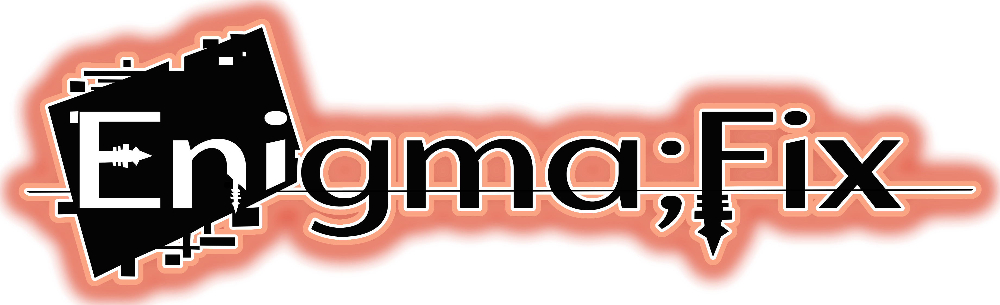
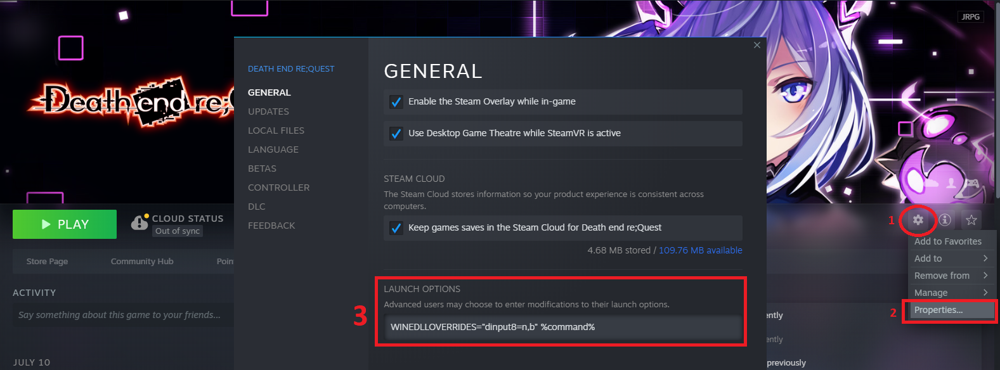

# EnigmaFix

### A mod that aims to improve several aspects of the PC versions for games in the Death end re;Quest series.*
#### * Support is also planned for MegaDimension Neptunia VIIR, Neptunia Virtual Stars, Dragon Star Varnir, and Mary Skelter 2.

**Key Features:**
* Uncapped framerates above or below 60 FPS *(Including VSync options, and fixes for framerate dependent gameplay logic)*
* Support for arbitrary resolutions and aspect ratios *(Including 16:10 and Ultrawide support)*
* Field of View customization *(While still retaining the intended FOV for in-game cutscenes)*
* Improved graphics, post-processing, and scalability options
* The option to skip opening videos
* In-Game UI to adjust options *(Can be accessed at any time using the **"DELETE"** key)*
* In-Game UI for developer logs *(Can be accessed using **"~/TILDE"**)*

## Compiling (For Programmers):
**NOTE:** Debugging through WINE is currently not available. This is something that needs to be resolved soon.

### Setup requirements:
* [CMake](https://cmake.org/)
* [Ninja](https://ninja-build.org/)
* [MinGW-w64 _(preferably with a full setup)_](https://www.mingw-w64.org/)
* [Git](https://git-scm.com/)

If you are using Ubuntu WSL, you can install the required dependencies using:

`sudo apt install git cmake ninja-build mingw-w64\* g++ gcc build-essential gdb -y`

For Fedora, the process would be:

`sudo dnf install git cmake ninja-build mingw64-\* g++ gcc -y`

### Recommendations:
* [JetBrains CLion](https://www.jetbrains.com/clion/) *(You can also use [Visual Studio](https://visualstudio.microsoft.com/vs/) to edit and compile the source code, assuming you install it with the C++ CMake tools for Windows component)*
* [Windows Subsystem for Linux _(If using Windows)_](https://ubuntu.com/wsl)

### Setup Instructions:
Assuming you have the development environment set up, you can follow these steps to compile the project:
1. `git clone https://github.com/KingKrouch/EnigmaFix --recursive`
2. `cd ./EnigmaFix`
3. Run either `./Build_Debug.sh` or `./Build_Release.sh` _(depending on what build type you want)_

**NOTE:** *If you have trouble running the build scripts, running `sudo chmod +x ./Build_Debug.sh && sudo chmod +x ./Build_Release.sh` should fix the problem.*
  **VS USERS:** If you are using Visual Studio:
1. Open the project file as a directory
2. Press the "Switch between solutions and available views" button in the Solution Explorer, and then double-click the "CMake Targets View".
3. Build the project by right-clicking "EnigmaFix Project" and then by clicking "Build All".

## Installation Instructions:
Copy the "Resources" folder and dinput8.dll into the **"\resource\bin\"** directory of where the game is installed.

**Note:** *If you don't have any other Steam library locations set up, this will likely be "**C:\Program Files (x86)\Steam\SteamApps\Common\Death end reQuest**".*

### Linux, Steam Deck, and Proton Compatibility Notice:
Add ``WINEDLLOVERRIDES="dinput8=n,b" %command%`` to the Steam launch options after following the installation instructions:

## System Requirements
* A *Legitimate* fully updated copy of the game from Steam or GOG (**I refuse** to provide technical support for pirated warez/scene cracked releases). 
[***Compatible games are available for purchase on Steam.***](https://store.steampowered.com/search/?category1=998&developer=Idea+Factory) 
[***Compatible games are also available for purchase on GOG.***](https://www.gog.com/en/games?developers=idea-factory-compile-heart&hideDLCs=true)

## Legal Stuff

**EnigmaFix (c) 2023 Bryce Q**

**Permission is hereby granted, free of charge, to any person obtaining a copy
of this software and associated documentation files (the "Software"), to deal
in the Software without restriction, including without limitation the rights
to use, copy, modify, merge, publish, distribute, sublicense, and/or sell
copies of the Software, and to permit persons to whom the Software is
furnished to do so, subject to the following conditions:**

**The above copyright notice and this permission notice shall be included in all
copies or substantial portions of the Software.**

**THE SOFTWARE IS PROVIDED "AS IS", WITHOUT WARRANTY OF ANY KIND, EXPRESS OR
IMPLIED, INCLUDING BUT NOT LIMITED TO THE WARRANTIES OF MERCHANTABILITY,
FITNESS FOR A PARTICULAR PURPOSE AND NONINFRINGEMENT. IN NO EVENT SHALL THE
AUTHORS OR COPYRIGHT HOLDERS BE LIABLE FOR ANY CLAIM, DAMAGES OR OTHER
LIABILITY, WHETHER IN AN ACTION OF CONTRACT, TORT OR OTHERWISE, ARISING FROM,
OUT OF OR IN CONNECTION WITH THE SOFTWARE OR THE USE OR OTHER DEALINGS IN THE
SOFTWARE.**

**[See the MIT License for more details.](https://github.com/KingKrouch/EnigmaFix/blob/master/LICENSE)**
